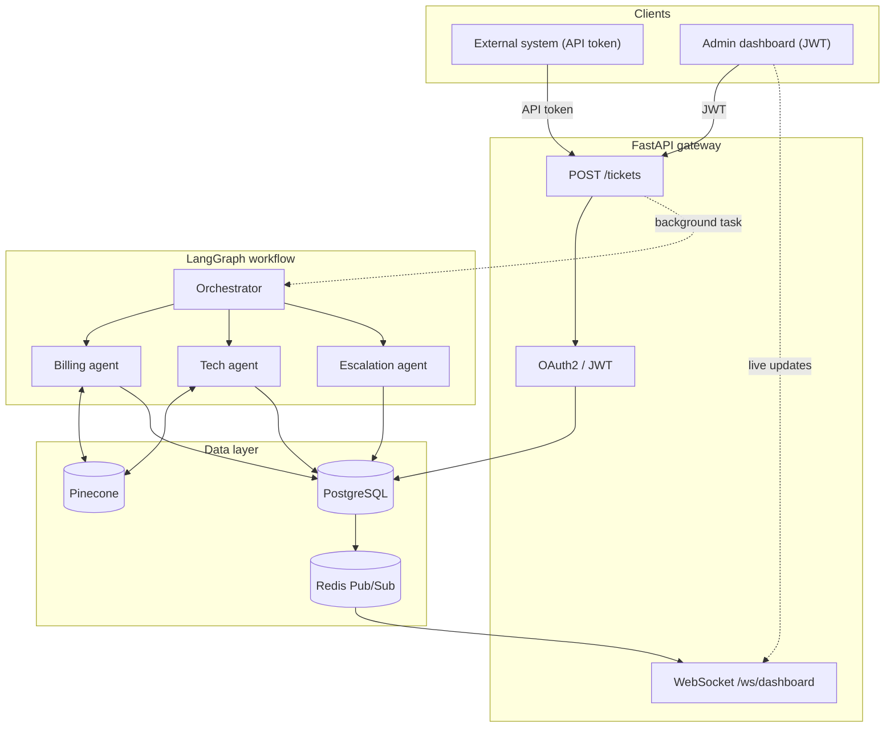
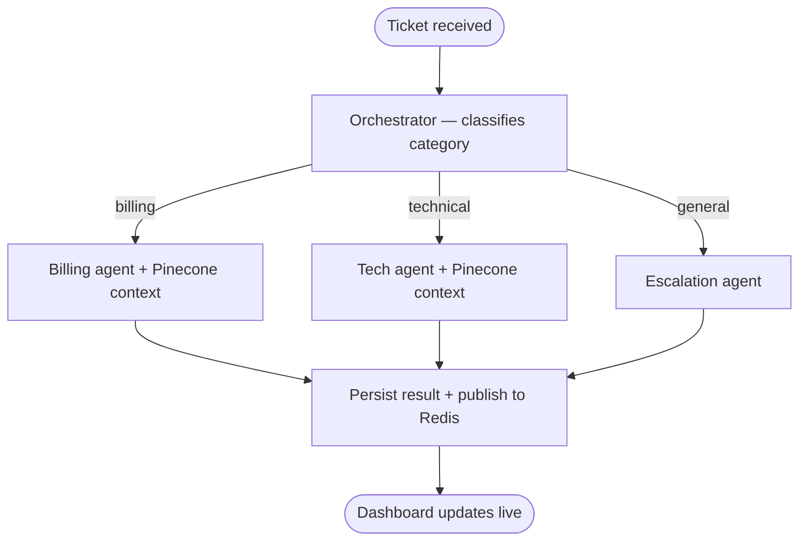

# Ticket Resolution Engine — API

A multi-agent backend that automatically classifies, routes, and resolves enterprise support tickets. Incoming tickets are processed by a LangGraph orchestration layer that routes them to specialized AI agents, with resolutions augmented by semantic search over past tickets. Results are pushed to connected clients in real time via WebSocket.

**Frontend repo:** [ticket-system-dashboard](https://github.com/husnain214/ticket-system-client) · **Live API:** http://d16ys3p7ql9k5b.cloudfront.net

---

## Architecture



---

## Agent graph



---

## Stack

FastAPI · PostgreSQL · SQLAlchemy (async) · LangGraph · LangChain · OpenAI · Pinecone · Redis · fastapi-users · Docker · GitHub Actions · AWS EC2 · AWS ECR

---

## Local setup

### Prerequisites

- Python 3.13+
- Docker (for Redis)
- OpenAI API key
- Pinecone API key

### 1. Clone and install

```bash
git clone https://github.com/husnain214/ticket-system-api
cd ticket-system-api
python -m venv .venv
source .venv/bin/activate   # Windows: .venv\Scripts\activate
pip install -r requirements.txt
```

### 2. Configure environment

```env
DATABASE_URL=sqlite+aiosqlite:///./test.db
REDIS_URL=redis://localhost:6379
JWT_SECRET=your-secret-key
CLIENT_URL=http://localhost:5173

OPENAI_API_KEY=sk-...
PINECONE_API_KEY=...

ADMIN_EMAIL=admin@company.com
ADMIN_PASSWORD=your-password

MAIL_USERNAME=resend
MAIL_PASSWORD=re_...
MAIL_FROM=onboarding@resend.dev
MAIL_FROM_NAME=Resolution Engine
MAIL_SERVER=smtp.resend.com
MAIL_PORT=465
MAIL_STARTTLS=False
MAIL_SSL_TLS=True
```

Generate a secure `JWT_SECRET`:

```bash
python -c "import secrets; print(secrets.token_hex(32))"
```

### 3. Start Redis

```bash
docker run -d --name redis -p 6379:6379 redis:alpine
```

### 4. Start the server

```bash
uvicorn app.main:app --reload
```

On first run the server automatically:

- Creates all database tables
- Seeds the admin user from `ADMIN_EMAIL` / `ADMIN_PASSWORD`
- Creates the Pinecone index if it doesn't exist

API docs available at `http://localhost:8000/docs`

---

## Docker

```bash
# build
docker build -t ticket-system-api .

# run with compose (includes Redis)
docker compose up -d

# logs
docker compose logs -f ticket-api
```

---

## Project structure

```
app/
├── agents/
│   ├── graph.py              # LangGraph StateGraph
│   ├── state.py              # TicketState TypedDict
│   ├── nodes/                # orchestrator, billing, tech, escalation
│   ├── prompts/              # prompt templates per agent
│   └── tools/                # db tools
├── auth/                     # fastapi-users setup
├── core/
│   ├── config.py             # pydantic settings
│   ├── email.py              # fastapi-mail setup
│   └── redis.py              # Redis client
├── db/
│   ├── tables.py             # SQLAlchemy models
│   ├── enums.py              # all enums
│   └── database.py           # async session + engine
├── routes/
│   ├── tickets.py            # ticket CRUD
│   └── dashboard.py          # WebSocket + analytics
├── scripts/
│   ├── seed_admin.py         # admin user seeding
│   └── create_pinecone_index.py
├── utils/
│   └── pinecone.py           # search + store functions
└── main.py
```

---

## API routes

| Method | Route             | Auth      | Description                    |
| ------ | ----------------- | --------- | ------------------------------ |
| `POST` | `/auth/register`  | Public    | Create account                 |
| `POST` | `/auth/jwt/login` | Public    | Get JWT token                  |
| `GET`  | `/users/me`       | JWT       | Current user                   |
| `POST` | `/tickets`        | Admin JWT | Create ticket + trigger agents |
| `GET`  | `/tickets`        | JWT       | List tickets with filters      |
| `GET`  | `/tickets/{id}`   | JWT       | Ticket detail with events      |
| `GET`  | `/analytics`      | JWT       | Dashboard metrics              |
| `WS`   | `/ws/dashboard`   | None      | Live ticket updates            |

---

## CI/CD

GitHub Actions pipeline on push to `main`:

```
test (ruff + mypy) → build Docker image → push to ECR → SSH into EC2 → restart containers
```

Deployments are blocked if linting or type checks fail.

---

## Deployment

Backend runs on AWS EC2 with Docker. Images are stored in AWS ECR and deployed automatically via GitHub Actions.

```
GitHub → ECR (image registry) → EC2 (runs containers)
                                  ├── FastAPI (port 8000)
                                  └── Redis (internal)
```

Database is hosted on AWS RDS PostgreSQL.
